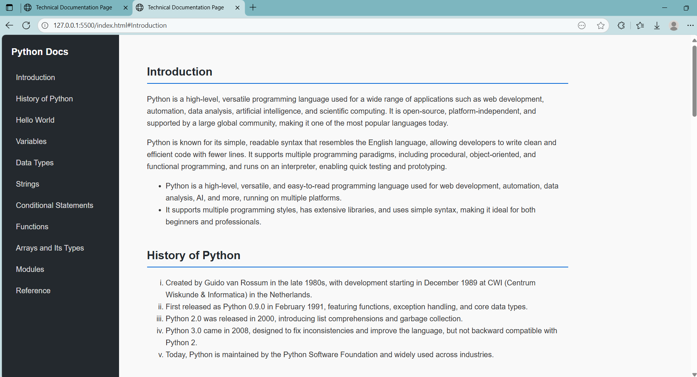

# 📘 Technical Documentation Page

A responsive **technical documentation page** project created with **HTML and CSS**, featuring sections on Python basics including variables, data types, functions, and more.  
This project was inspired by developer documentation sites, designed for **learning + practicing web development**.

---

## 🚀 Features
- Clean and responsive design (works on desktop & mobile)  
- Sidebar navigation with smooth scrolling  
- Sections include: Introduction, History of Python, Variables, Data Types, Strings, Functions, and more  
- Highlighted code blocks for readability  
- Beginner-friendly HTML & CSS project  

---

## 📸 Screenshot



---

## 🛠️ Tech Stack
- **HTML5** → for structure  
- **CSS3** → for layout & styling  
- **GitHub Pages** → for free hosting  

---

## 📂 Folder Structure
technical-documentation-page/
│-- index.html # Main HTML file
│-- styles.css # Styling
│-- .gitignore # Ignore unnecessary files
│-- README.md # Documentation
│-- images/ # (Optional) Screenshots, logos, etc.

## 💻 How to Run Locally
1. Clone the repository:
   ```bash
   git clone https://github.com/udayreddy-86/technical-documentation-page.git
2.Open the project folder:
     cd technical-documentation-page
3.Open index.html in your browser.

🌐 Live Demo

Once GitHub Pages is enabled, the project will be live here:
👉https://udayreddy-86.github.io/technical-documentation-page

📚 Learning Outcomes

* Through this project, you will practice:
* Structuring a webpage with semantic HTML
* Styling with CSS (layout, sidebar, responsiveness)
* Hosting static sites using GitHub Pages
* Writing clean project documentation (README.md)

👨‍💻 Developed by Uday Reddy

---

📌 Next Step for You:  
- Create an `images/` folder in your repo.  
- Upload a screenshot of your page (e.g., `screenshot.png`).  
- Update the README to display it.  


